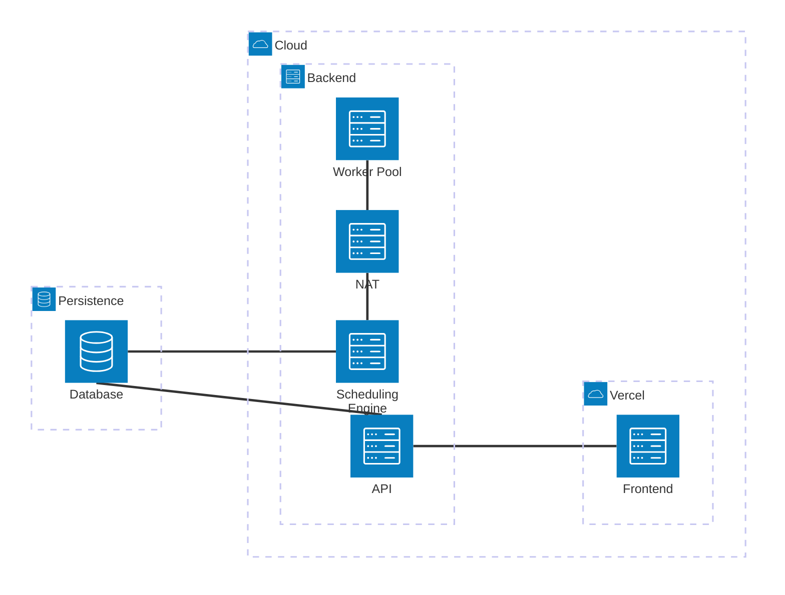

# 4Cs

## Context

## Components

```mermaid 
architecture-beta

    group cloud(cloud)[Cloud]

    group vercel(cloud)[Vercel] in cloud

    service frontend(server)[Frontend] in vercel

    group backend(server)[Backend] in cloud

    service api(server)[API] in backend
    service sch(server)[Scheduling Engine] in backend
    service worker(server)[Worker Pool] in backend
    service nat(server)[NAT] in backend

    group persistence(database)[Persistence]
    service db(database)[Database] in persistence

    %% api:L -- R:persistence
    frontend:L -- R: api
    api:T -- B:db
    sch:L -- R:db
    sch:T -- B:nat
    nat:T -- B:worker
```

## Containers

## Classes
